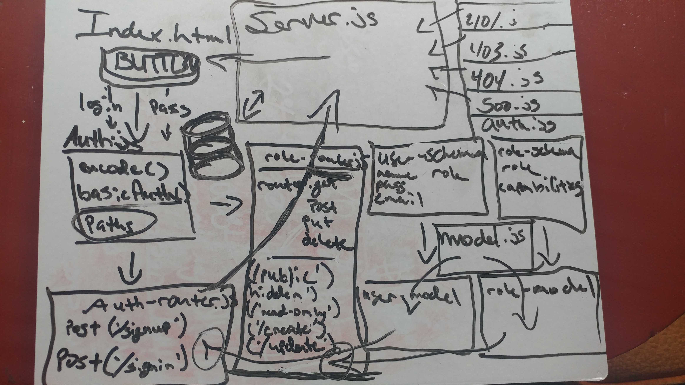

# LAB - 13

## Access Control

### Author: James Dunn

### Links and Resources

- [submission PR](https://github.com/james-401-advanced-javascript/lab-13/pull/1)
- [travis](https://travis-ci.com/james-401-advanced-javascript/lab-13)
- [front-end](https://jamesdunn-lab-11.herokuapp.com)

### Modules

#### `github-mw.js`

#### `google-mw.js`

#### `401.js`

#### `403.js`

#### `404.js`

#### `500.js`

#### `auth.js`

#### `auth-router.js`

#### `role-router.js`

#### `model.js`

#### `roles-model.js`

#### `roles-schema.js`

#### `users-model.js`

#### `users-schema.js`

#### `server.js`

##### Exported Values and Methods

###### `get(_id)`

###### `getFromField(query)`

###### `create(record)`

###### `update(_id, record)`

###### `delete(_id)`

###### `create(req, res, next)`

###### `authenticate(req, res, next)`

###### `setToken(req, res, next)`

###### `authBasic(credentials)`

###### `can(role)`

###### `authenticateBasic(token)`

###### `generateToken(timeout)`

### Setup

#### `.env` requirements

- `PORT`
- `MONGODB_URI`
- `JWT_SECRET`

#### Running the app

- `npm start`
- Endpoint: `index.js`

#### Tests

- How do you run tests?
- `npm run lint` - Check for lint errors
- `npm start` - Start application
- `Login with creds of someone in the db to make sure you get correct token notification`
- `Click each button depending on user's level of access to make sure you're getting correct response`

#### UML

